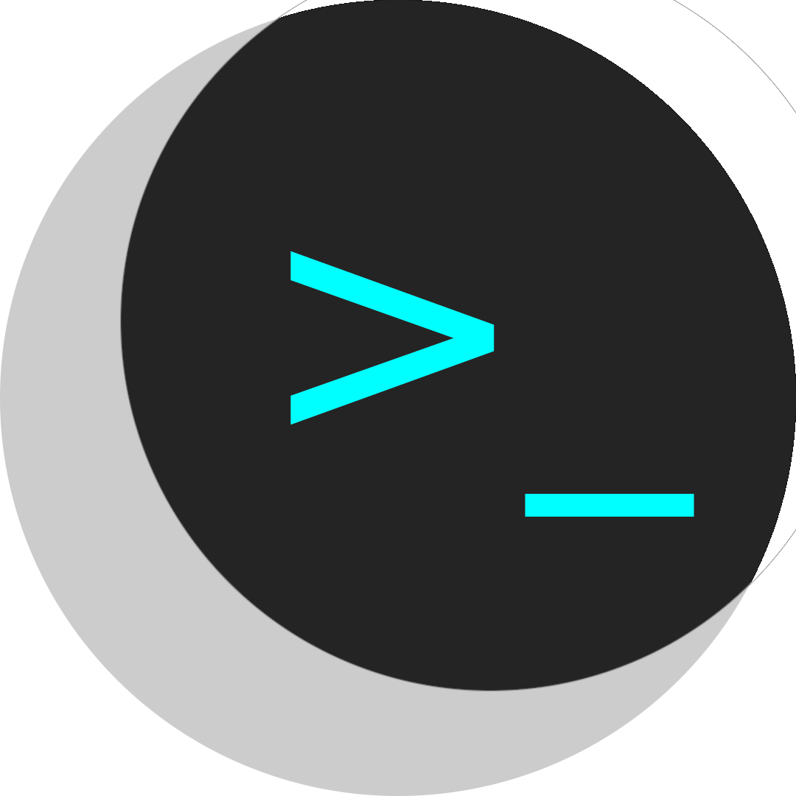

# Nocterm - Simple Terminal UI Library

<p align="center">
      
</p>

Nocterm is a terminal user interface library for basic needs, designed to be used with C/C++. 
It is expected to evolve and improve in time. New widgets will be added when there is a need.

# Sample Widget Demonstration


---

# Installation

## From Source

Nocterm headers and library are installed to `/usr/share/include` and `/usr/share/lib` respectively.

```shell
git clone https://github.com/technicaluserx/nocterm.git
cd nocterm
./configure --targets=nocterm
make
sudo make install
```

**To uninstall**:
```
sudo make uninstall
```

# Usage

After installation, one can include Nocterm's main header and link the program against the static library.

**Simple C Application:**

Open a new source file `main.c`:

```c
#include <nocterm/nocterm.h>

int main(){

    nocterm_widget_t* main_widget = nocterm_widget_new((nocterm_dimension_t){0, 0, 10, 20}, NOCTERM_WIDGET_FOCUSABLE_YES, NOCTERM_WIDGET_TYPE_REAL);
    nocterm_page_t* main_page = nocterm_page_new("Main Page", 10, main_widget);

    nocterm_page_stack_push(main_page);

    nocterm_loop();
        
    nocterm_page_delete(main_page);
    nocterm_widget_delete(main_widget);

    return EXIT_SUCCESS;
}
```

Link it with:

```shell
gcc main.c -lnocterm -o hello_nocterm
```

To run your program:

```shell
./hello_nocterm
```

> Please refer to documentation for more information about using the Nocterm library
