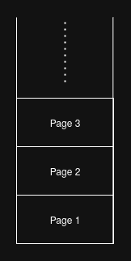

\page pagestack Pages

A page (`nocterm_page_t`) is a high level structure which contains the main widget, which is called **root widget** in terms of Nocterm.
Pages are stored in a stack data structure where top of the stack is considered as the active page.



Whenever a new page is pushed or the current page is popped, every widget is redrawn on the new current page.
If there are no more pages left on the stack, then the main loop finishes (Refer to \ref mainloop) and terminal returns to its original form, meaning no more widget operations.

> Main loop (Refer to \ref mainloop) requires at least 1 page to be on the stack, otherwise, main loop immediately exits.


---

# API Overview

## New Pages

Creating new pages is relatively easy, it just necessitates a label and a root widget candidate:

```c
#include <nocterm/nocterm.h>

int main(){

	nocterm_dimension_size_t row = 0, col = 0, height = 10, width = 10;

	nocterm_widget_focusable_t focusable = NOCTERM_WIDGET_FOCUSABLE_YES;
	nocterm_widget_type_t type = NOCTERM_WIDGET_TYPE_REAL;

	nocterm_widget_t* my_widget = nocterm_widget_new((nocterm_dimension_t){row, col, height, width}, focusable, type);

	nocterm_page_t* main_page = nocterm_page_new("Main page", my_widget);

	nocterm_widget_delete(my_widget);
	nocterm_page_delete(main_page);	

	return 0;
}

```

## Pushing & Popping Pages

There are two related functions for these operations:

**Pushing**

```c
nocterm_page_stack_push(main_page);
```

**Popping**

```c
nocterm_page_stack_pop();
```

